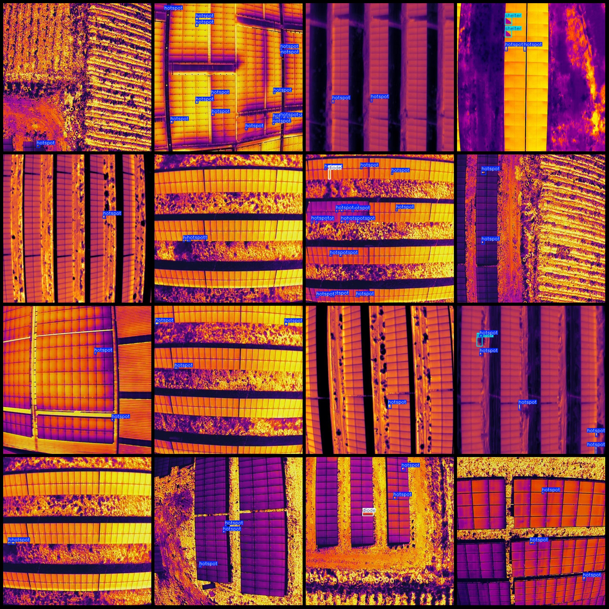
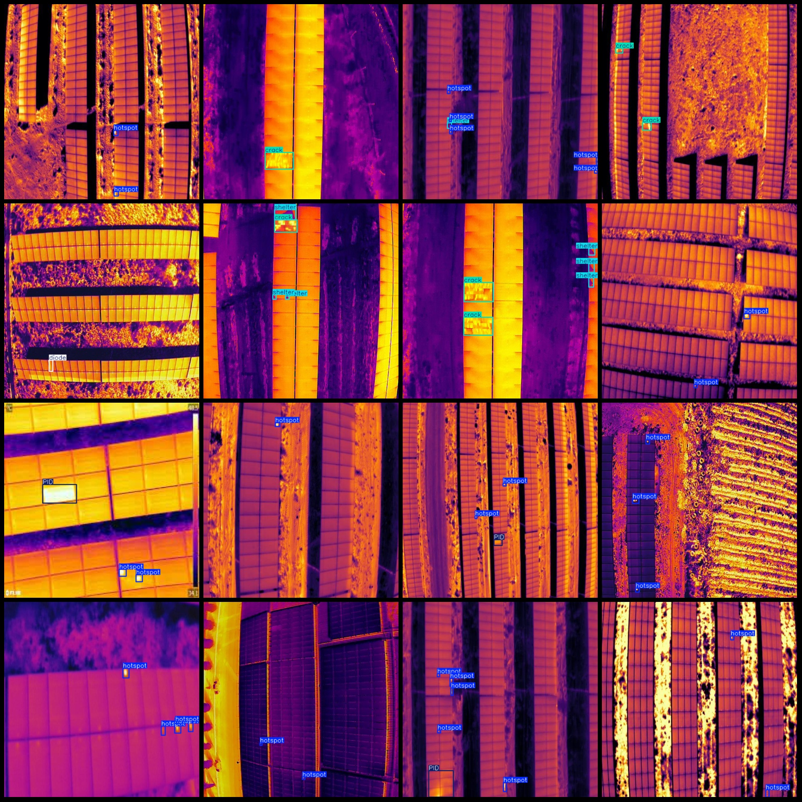

# Drone-Viewed Solar Photovoltaic Panel Thermal Imaging Infrared Image Fault Detection Dataset (VOC+YOLO format) - 1229 Images in 5 Categories

Dataset format: Pascal VOC format plus YOLO format (txt file without segmentation path, only containing jpg images along with corresponding VOC format xml files and YOLO format txt files).
Number of images (jpg file count): 1229
Number of annotations (xml file count): 1229
Number of annotations (txt file count): 1229
Number of annotation categories: 5
Annotation category names (note that the order of labels in the YOLO format does not correspond to this, but is based on the "labels" folder's "classes.txt" file): ["PID", "crack", "diode", "hotspot",
 "shelter"]
Each category annotation box count:
PID (Potentially Irradiance Dependent Absorption) boxes = 248
crack (Crack) boxes = 305
diode (Diode) boxes = 470
hotspot (Hotspot) boxes = 3639
shelter (Shield) boxes = 895
Total number of boxes: 5557
Image resolution: 640x640
Annotation tool used: labelImg
Annotation rules: draw bounding boxes for each category
Important note: No guarantee of model or weight file accuracy training on this dataset.
Picture preview:
Annotation example:

## Images

Here is a pay link on Stripe ( https://buy.stripe.com/3cs8yP7sY87d0vu9AB ). Please contact me lonlonago@foxmail.com after funding $89, and I will send you a complete data files , thank you!

